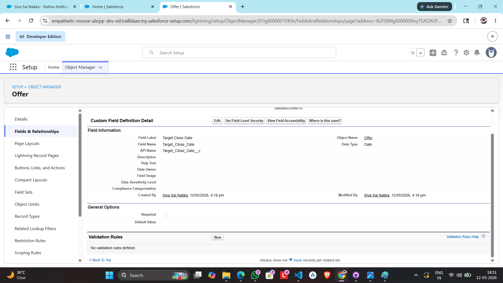
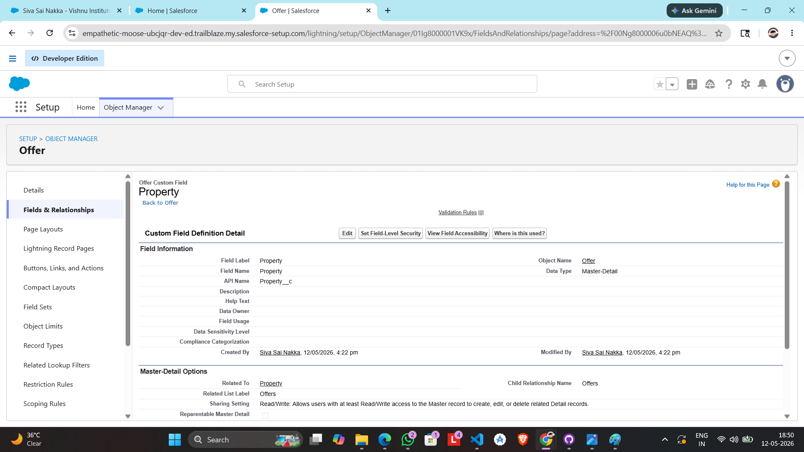
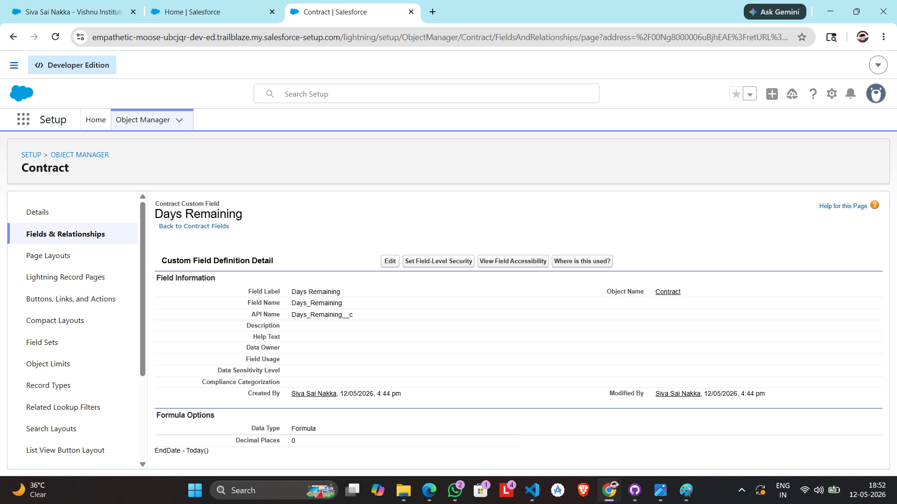
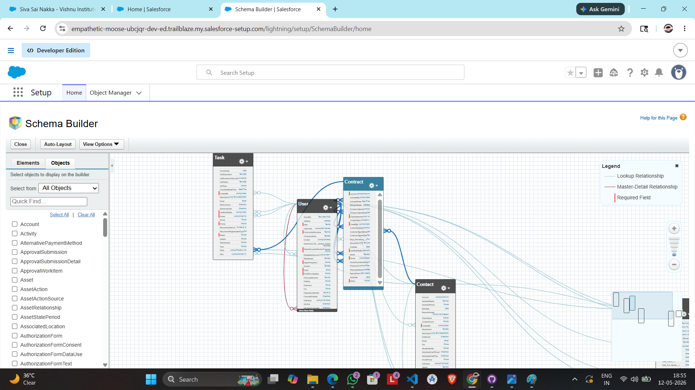
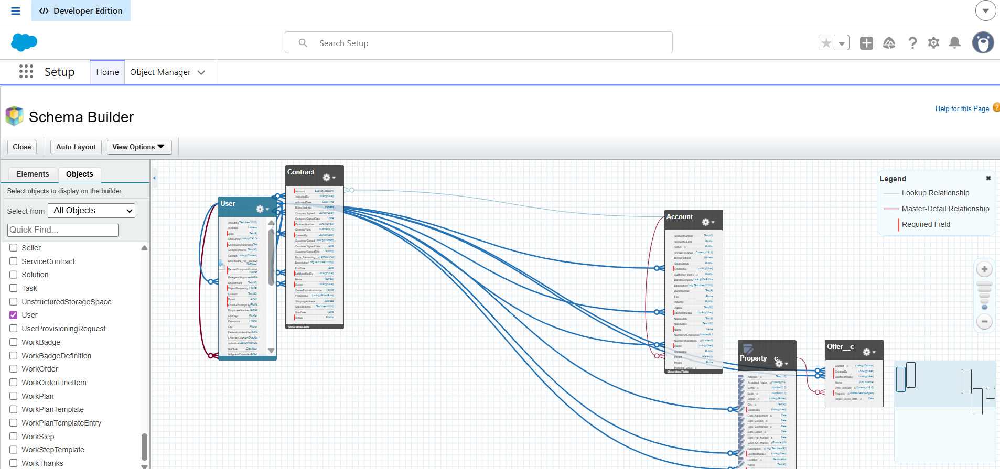
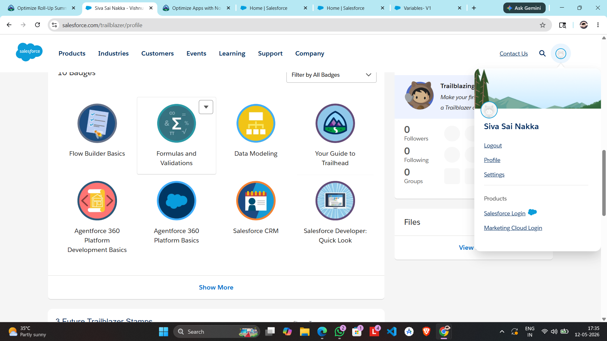
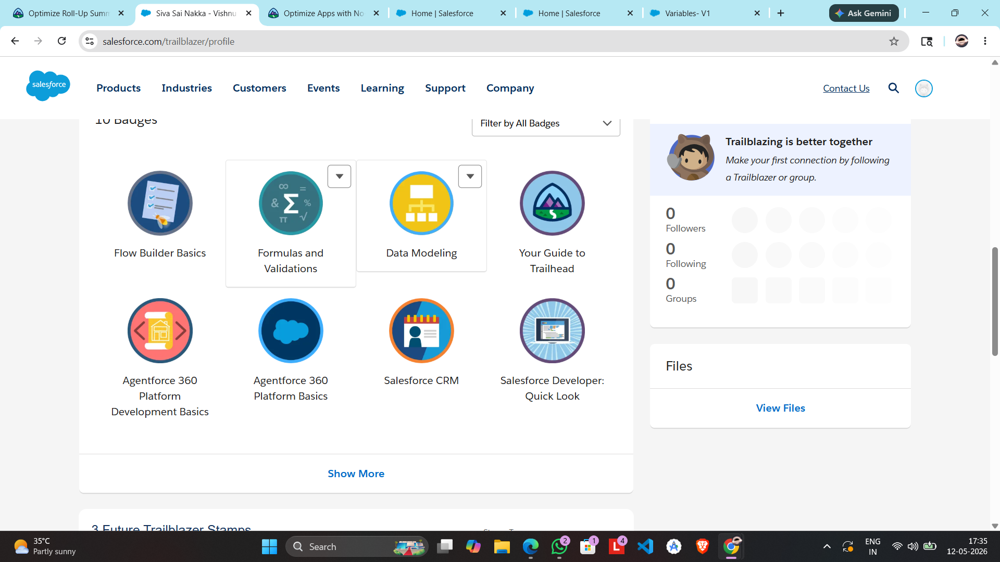

Day 3: Data Modeling & Business Logic

1. Core Definitions  
 App: A collection of tabs and objects that work together to serve a specific business function.  
 
 Object: A database table that stores specific types of information (e.g., Students or Courses).
 
 Record: An individual item within an object; essentially a single row in the database table.
 
 Field: A specific piece of information within a record, like a "Student Name" or "Email".  
 
 2. Standard vs. Custom Objects
 
    Standard Objects: Pre-built objects included with Salesforce by default, such as Accounts, Contacts, and Leads.
    
    Custom Objects: New objects created by a user to meet specific business needs unique to their organization.  
3. College Data Model   Objects & Relationships   

Department: The parent object.

Faculty: Linked to Department via a Lookup Relationship (One Department has many Faculty). 

Student: Linked to Department via a Lookup Relationship.  

Course: Linked to Department; can also have a relationship with Faculty.  

4. Formula Fields   

Formula Field,    Logic / Calculation,Why Automate? 
Full Name,"FirstName & "" "" & LastName",Ensures consistency and saves manual typing.
Remaining Seats,Total_Seats__c - Occupied_Seats__c,Real-time accuracy for course availability.
Pass Percentage,(Marks_Obtained__c / Total_Marks__c),Eliminates manual calculation errors..

5. Validation Rules 
Rule Name             Error Condition            Problem Prevented 
Negative_Age_Check    Age__c < 0               Prevents physically impossible data entry.
Invalid_Email        ISBLANK(Email__c)          Ensures communication channels are always available.
Seat_Limit_Exceed  Enrolled__c > Max_Seats__c  Prevents over-enrollment in a classroom.

6. Reflection: Why Structured Data Matters   

Companies prefer structured enterprise data over spreadsheets because Excel lacks data integrity, scalability, and complex relationship mapping. Structured data ensures that when a Department name changes, it updates across all linked Student and Faculty records automatically, preventing inconsistent and "dirty" data.

Snapshorts for day3

