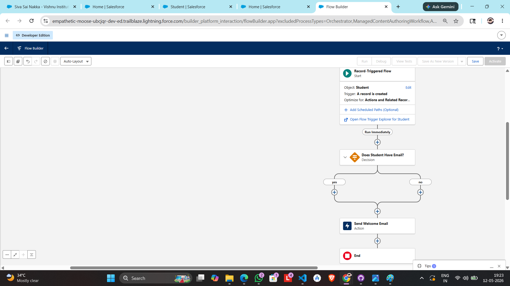
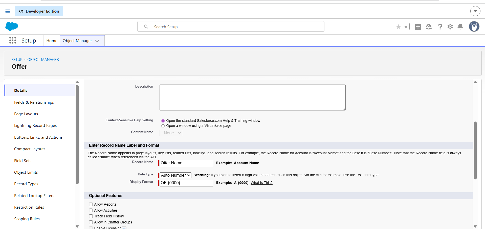
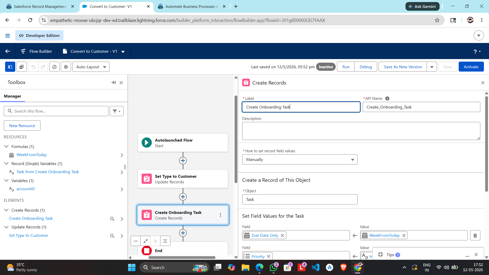
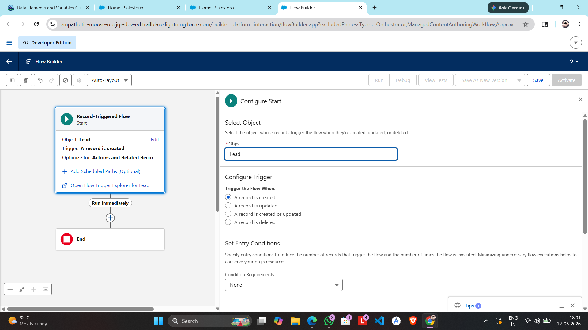
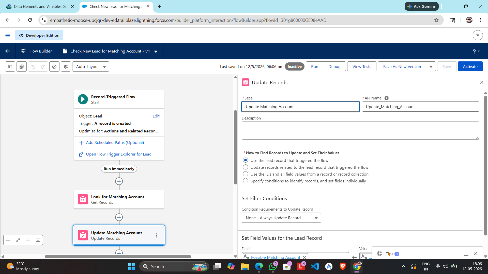
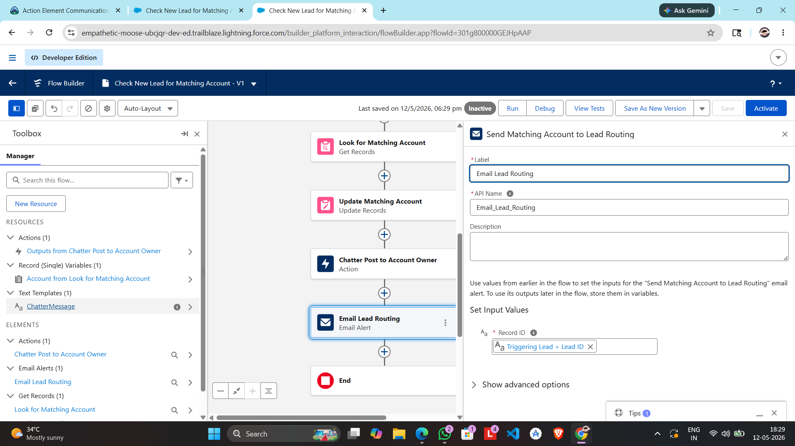
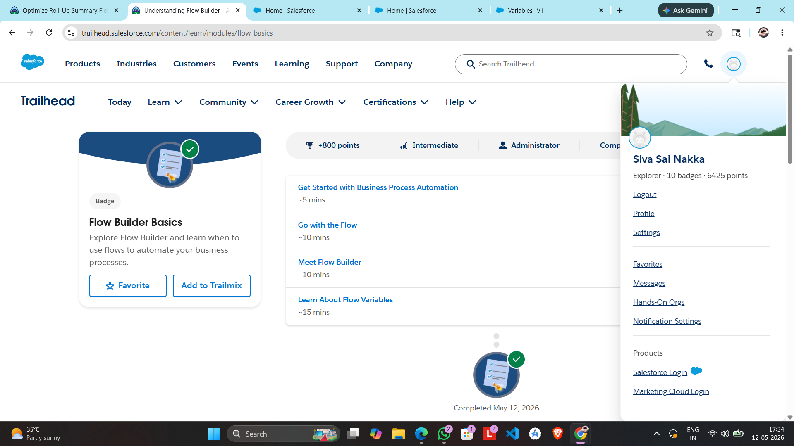
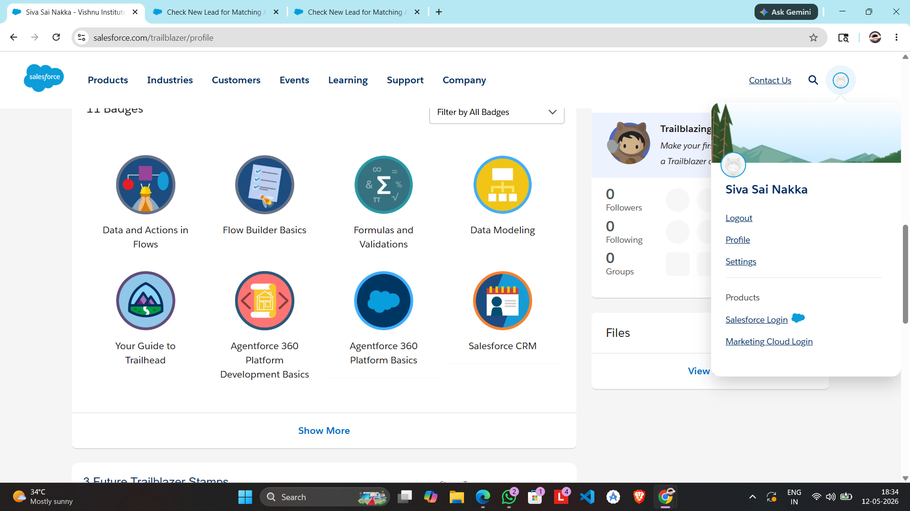

Day 4: Process Automation with Flow Builder

1. What is Flow Builder?

   Flow Builder is a point-and-click tool used to automate complex business processes by collecting data and performing actions within the Salesforce org without writing code.  

2. Types of Flows   

 Screen Flow: Requires user interaction; presents a UI (screens) to guide a user through a process.  

 Record-Triggered Flow: Runs automatically in the background when a record is created, updated, or deleted.  

3. Automation Ideas (College Management)   

         
 Auto-Welcome Email: Send a welcome email automatically when a Student record is created.  

 Seat Count Update: Automatically decrement "Remaining Seats" when a student enrolls in a Course.  

 Faculty Notification: Send a Chatter post to Faculty when their course reaches 100% capacity.  

 Student ID Generation: Automatically generate a unique Student ID based on year and department code.  

 Fee Reminders: Send an automated email reminder 7 days before the fee payment deadline.  

4. Flow Design: Student Registration   

 Process: Trigger an email when a new student registers.
 
 Trigger: Record Created (Student Object).  
 
 Decision: Is the Student's Email field populated?.  
 
 Action: Send "Registration Successful" Email Action.  
## 4. Your Flow Diagram

5. Manual vs. Automated Process   
 
 Manual: A staff member checks a list of new students every morning and manually types/sends welcome emails.  
 
 Problems: High risk of human error, slow response time, and it is a repetitive, boring task.  
 
 Automation: Salesforce detects the new record and sends the email instantly. This ensures 100% consistency and frees staff for higher-value work.  
 
6. Reflection: The Power of Automation   

 Companies automate repetitive processes to improve productivity and ensure data consistency. 
 No-code automation is powerful because it allows business analysts to build and maintain workflows quickly without waiting for expensive software development cycles.  

Snapshots

